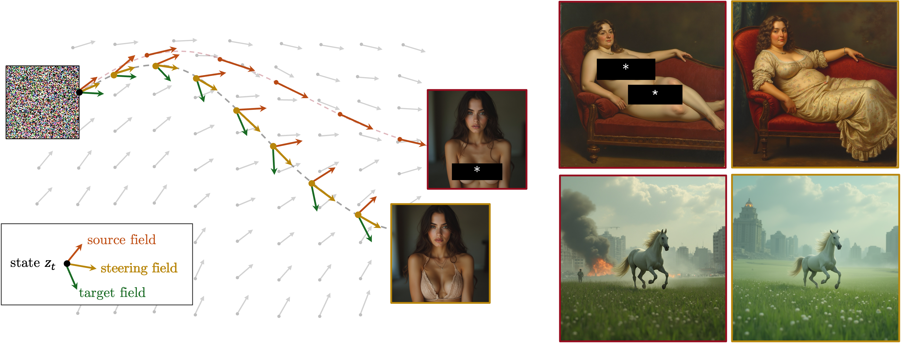

# SteeringFields



## Repository structure

```text
SteeringFields/
├── configs/
│   ├── default.yaml          # Portable defaults committed to the repository
│   ├── local.yaml.example    # Template for machine-specific paths
│   └── local.yaml            # Local paths; ignored by Git
│
├── flux_t2i.py               # Canonical Flux text-to-image launcher
├── flux_i2i.py               # Canonical Flux image-to-image launcher
├── sd_t2i.py                 # Canonical SD3/SD3.5 text-to-image launcher
├── sd_i2i.py                 # Canonical SD3/SD3.5 image-to-image launcher
│
├── steering_fields/
│   ├── cli/
│   │   ├── flux_t2i.py       # Flux t2i argument parsing and workflow dispatch
│   │   ├── flux_i2i.py       # Flux i2i argument parsing and workflow dispatch
│   │   ├── sd_t2i.py         # SD t2i argument parsing and workflow dispatch
│   │   └── sd_i2i.py         # SD i2i argument parsing and workflow dispatch
│   ├── config.py             # YAML, environment, and CLI configuration
│   ├── runtime.py            # Device, dtype, generator, and seed handling
│   ├── schedules.py          # Alpha and mu schedules and validation
│   ├── datasets.py           # CSV loading and normalized prompt records
│   ├── embeddings.py         # Average-embedding payload I/O
│   ├── compute_avg_embeddings.py # Flux average-embedding generation
│   ├── outputs.py            # Run names, images, paired views, and metadata
│   ├── common.py             # Shared types and small helpers
│   ├── flux_utils.py         # Flux loading, conditioning, sampling, and decoding
│   ├── sd_utils.py           # SD3/SD3.5 loading, sampling, i2i setup, and decoding
│   └── utils.py              # Shared legacy-compatible workflow utilities
│
├── flux.py                           # Legacy Flux baseline wrapper
├── sd.py                             # Legacy SD wrapper
└── data/, experiments/, metrics/, visuals/, ... # Existing project material
```

The root launchers are intentionally small. The reusable implementation lives in `steering_fields/`, with all Flux-specific code in `flux_utils.py` and all SD-specific code in `sd_utils.py`.

## Configuration

Configuration values are applied in this order, from lowest to highest priority:

```text
built-in defaults
  → configs/default.yaml
  → --config YAML file
  → environment variables
  → explicit command-line arguments
```

Configure the local Flux checkpoint with `paths.flux_checkpoint` in `configs/local.yaml`. Machine-specific values belong in that ignored file and should not be added to `configs/default.yaml`.

Supported checkpoint environment variables are `FLUX_CHECKPOINT`, `SD3_CHECKPOINT`, and `SD35_CHECKPOINT`.

## Generation and steering modes

The new commands distinguish the generation mode from the steering formula:

```text
--generation-mode baseline|steer
--steering-mode add|replace
```

For example, `--generation-mode steer --steering-mode add` applies the additive minimal-transport blend. The old ambiguous form `--mode add` remains available only through the compatibility wrappers.

## Example: dog to spaghetti


This reproduces the Flux text-to-image run that steers **“a dog playing in the snow”** toward **“spaghetti”** using add mode and seed 42:

```bash
cd SteeringFields

python flux_t2i.py \
  --config configs/local.yaml \
  --generation-mode steer \
  --steering-mode add \
  --prompt "a dog playing in the snow" \
  --target-prompt "spaghetti" \
  --height 1024 \
  --width 1024 \
  --num-steps 28 \
  --cfg-src 1.5 \
  --cfg-tar 5.5 \
  --alpha-schedule linear \
  --alpha 0.5 \
  --alpha-start 0.4 \
  --alpha-end 0.0 \
  --mu-schedule constant \
  --mu 0.5 \
  --mu-start 0.5 \
  --mu-end 0.5 \
  --seed 42 \
  --device cuda:0 \
  --dtype bfloat16
```

To generate the source baseline and a side-by-side comparison in the same run, append:

```bash
--include-baseline
```

That run contains:

```text
baseline.png
steered.png
paired.png
meta.json
```

Without `--include-baseline`, it contains only `steered.png` and `meta.json`.

## Computing Flux average embeddings

Average safe and unsafe Flux embeddings can be built from a paired prompt CSV with:

```bash
python -m steering_fields.compute_avg_embeddings \
  --config configs/local.yaml \
  --pairs-csv data/naked.csv \
  --src-col positive_prompts \
  --tar-col negative_prompts \
  --max-rows 50 \
  --only-avg-embedding \
  --device-number 0 \
  --seed 42
```

By default, this writes a uniquely named payload and matching metadata file under `data/average_embeddings/`.
